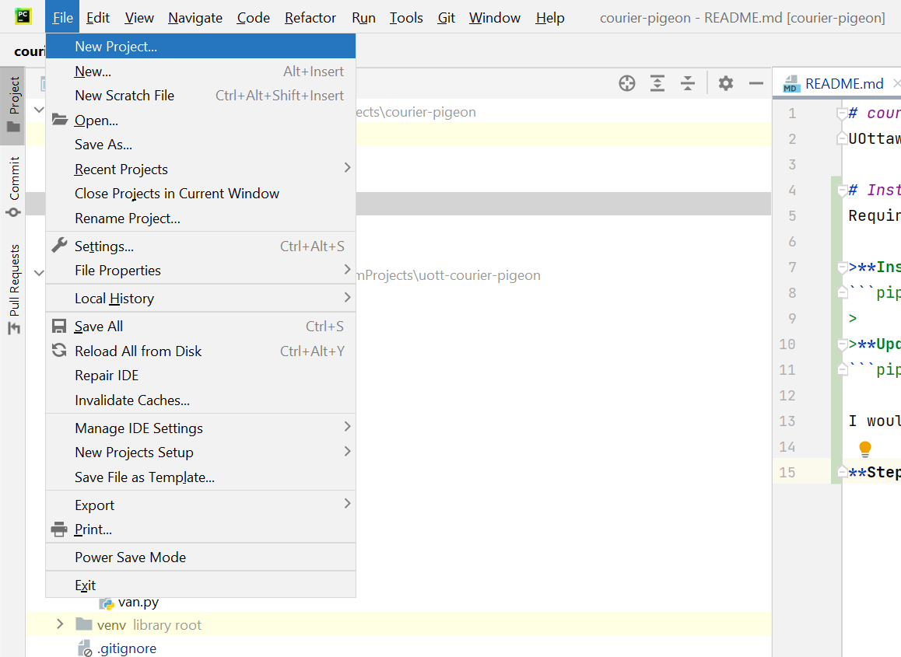
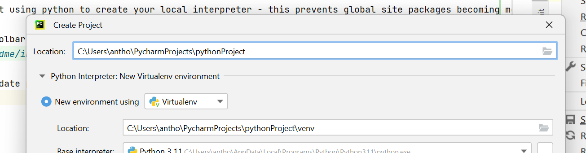

# courier-pigeon
UOttawa Hackathon 2023 - Package delivery optimization service

# Installation
Requirements are saved in `requirements.txt`.

>**Install Requirements:**
```pip3 install -r requirements.txt```
> 
>**Update Requirements**
```pip3 freeze > requirements.txt```

I would suggest using python to create your local interpreter - this prevents global site packages becoming messy. You can do this using pycharm very easily from within an existing repository.

**Step 1:** Toolbar > File > New Project


**Step 2:** Update project dir to be current dir

Click on the folder button beside the Location tab:


Navigate to the project directory

**Step 3:** Create Venv

Default settings are OK, click on the <span style="color:teal">Create</span> button. You should see a venv folder created!


goodluck!

# Navigating git
1) Fork this repository
2) checkout feature branch using `git checkout -b branch_name`
3) commit, push changes as necessary using `git add filename` and `git commit -m commit message` and `git push`
4) use `git status` to view changes
5) rebase against master before you pull request
6) pull request & merge to main!